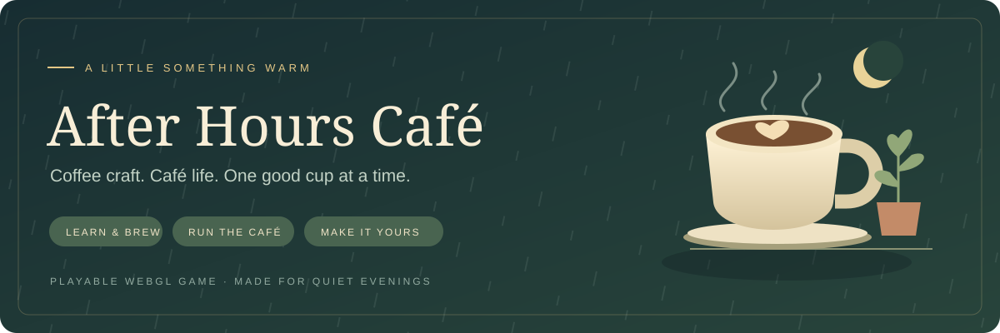
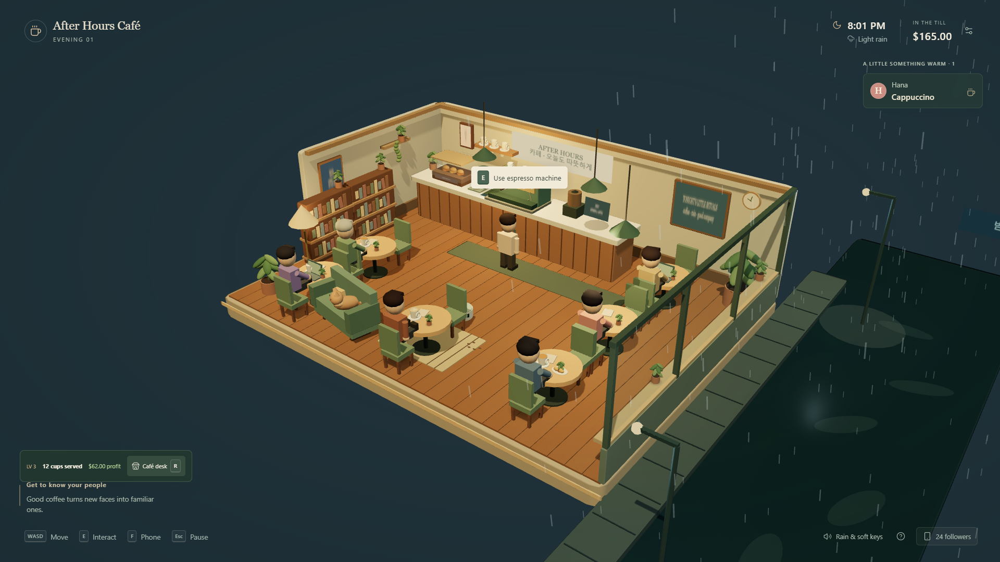
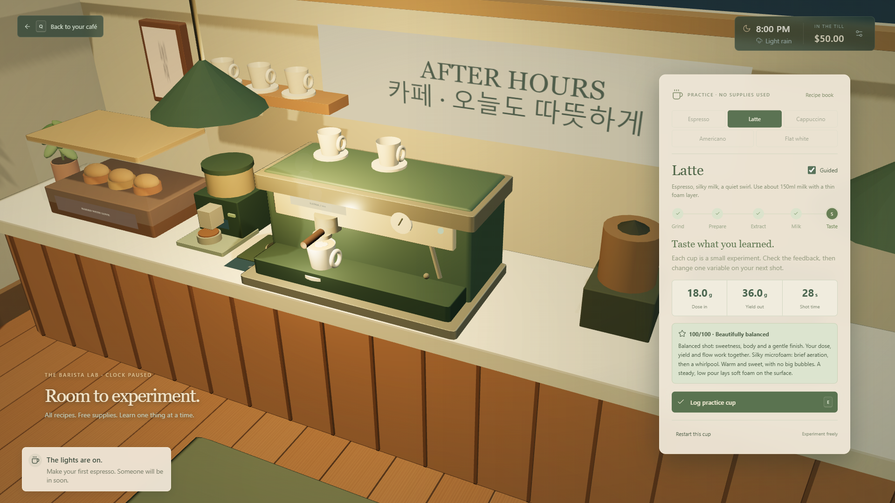
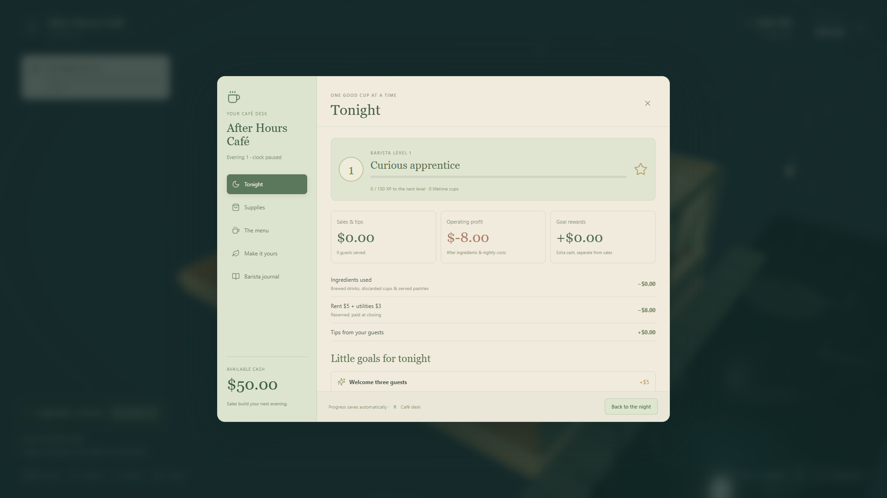
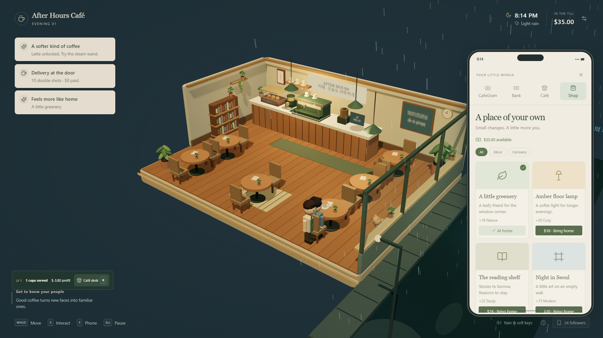
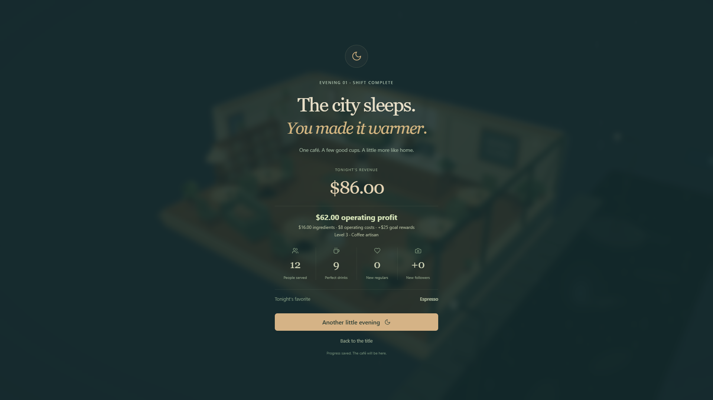

<p align="center">
  
</p>

<p align="center">
  <a href="https://github.com/MannanBabar16/after-hours-cafe-webgl/actions/workflows/ci.yml"></a>
  
  
  
</p>

<p align="center">
  <a href="https://after-hours-cafe.upbeat-badge-4829.chatgpt.site"><b>Open the hosted game</b></a> ·
  <a href="#play-locally">Local setup</a> ·
  <a href="GAME_DESIGN.md">Game design</a> ·
  <a href="CONTRIBUTING.md">Contributing</a>
</p>

# After Hours Café

**Learn the ritual. Earn your first regular. Build a café that feels like yours.**

An evening café simulator where every cup has a process and every sale helps the business grow. Start with guided espresso, practice milk and latte art at your own pace, then spend an evening serving familiar faces, watching your margins, and making a rainy little café your own.

A playable WebGL café game built with React, TypeScript, Three.js / React Three Fiber, Zustand and Vite. All scenery, characters and sound effects are procedural; playing loads no remote media or paid APIs. Saves stay in the current browser.

The hosted release currently uses private Sites access. Repository access and hosted-game access are separate; local play works without a Sites account.

## A night at the café



| Learn the craft | Run the business | Make it yours |
| --- | --- | --- |
| Five recipes, three bean profiles, grind and dose controls, shot feedback, milk texturing, latte art, and free practice. | Stock, pricing, pastries, tips, ingredient costs, daily goals, closing reports, and a path to café ownership. | Café name, apron and cup colors, wall moods, décor purchases, a cat, and a helpful little robot. |

<table>
  <tr>
    <td width="50%"><br /><b>A hands-on coffee ritual</b><br />Grind, distribute, tamp, extract, texture, and pour.</td>
    <td width="50%"><br /><b>A business you can understand</b><br />Follow costs, set prices, stock the bar, and choose your look.</td>
  </tr>
  <tr>
    <td><br /><b>A place that grows with you</b><br />Meet regulars, post to CafeGram, and shop for upgrades.</td>
    <td><br /><b>Every evening has an outcome</b><br />Review the shift and plan your next night.</td>
  </tr>
</table>

Screenshots show the playable browser build. Later-shift images use representative test saves; see [Validation](VALIDATION.md).

## Play locally

Requires **Node.js 22.12 or newer**, npm, and a desktop browser with WebGL. No API keys, environment variables, or backend setup are required.

```sh
git clone https://github.com/MannanBabar16/after-hours-cafe-webgl.git
cd after-hours-cafe-webgl
npm ci
npm run dev
```

For this private repository, clone while signed in to a GitHub account with access. Open Vite’s printed address, usually `http://127.0.0.1:5173`. Click **Open your café** to start the night and enable sound.

```sh
npm test
npm run build
npm run preview
```

The production build is in `dist/`; serve it over HTTP, rather than opening `index.html` directly. Dependencies are locked in `package-lock.json`. GitHub Actions runs the game tests and production build, then attaches the compiled game as a downloadable artifact. See [Contributing](CONTRIBUTING.md) for the development workflow and [Architecture](docs/ARCHITECTURE.md) for the source map.

**CI status at setup:** local installation, all 20 tests, and the production build passed. GitHub currently stops this repository's runs before creating a job; cloud checks have not passed yet. See [Validation](VALIDATION.md) for the recorded status. A packaged build is available under [Releases](https://github.com/MannanBabar16/after-hours-cafe-webgl/releases).

## Your first cup

1. Press **E** near the machine. Choose Espresso and the house blend.
2. Grind the measured dose, distribute, tamp, then lock the portafilter and place the cup.
3. Start extraction. Guided mode stops at a 1:2 dose-to-yield ratio. Check the tasting feedback and take the tray.
4. Walk through the middle aisle to Minho. Face him and press **E** when the serve prompt appears.
5. The till receives the sale and tip. Your first service unlocks Latte. Milk drinks add wand purging, hold/release texturing, and a controlled pour.
6. Press **R** for the café desk: goals, profit, stock, prices, pastries, customization and the barista journal.
7. Try the practice bar for free supplies, every recipe and a paused café clock. Turn off **Guided** for timed tamping and manual shot stopping.

## Controls

| Key         | Action                                              |
| ----------- | --------------------------------------------------- |
| WASD        | Walk relative to the camera                         |
| E           | Interact, advance a brewing step, or serve a guest  |
| Space, held | Texture milk; release in the green temperature band |
| R           | Café desk                                           |
| F           | Phone, social posts, bank, regulars and shop        |
| Tab         | Furniture shop                                      |
| Q / Escape  | Back; pause when in the café                        |
| Mouse       | Recipes, dials, pour control and menus              |

Touch movement controls and responsive panels are included, but desktop is the primary target. Settings include master/music/effects volume, graphics quality, camera softness and fullscreen.

## Implemented game systems

- **Five recipes:** Espresso, Latte, Cappuccino, Americano and Flat white. Unlocks follow completed services; practice opens all five.
- **Three bean profiles:** House, bright single origin and midnight roast. Grind and dose affect shot flow, brew ratio, time and tasting feedback.
- **A hands-on ritual:** Measured grinding, distribution, a level-tamp timing exercise, locking, extraction, steam-wand purging, milk heating, pouring and heart/rosetta finishes.
- **Gentle learning:** One next action, optional dial controls, Guided timing, free practice, a recipe book, recorded tasting notes and personal bests.
- **Café economics:** Inventory, immediate deliveries, ingredient consumption and waste costs, three pricing policies, pastry pairings, tips, rent/utilities and operating profit.
- **Progression:** XP, five barista titles, automatic daily-goal cash rewards, returning regulars, reputation, followers and recipe unlocks. Save $500 to buy the café and remove nightly rent.
- **Care and customization:** Flush/wipe the bar, clear used tables, buy Mochi to clear tables automatically, rename the café, change apron and cup colors, select three wall moods, and purchase eight décor/equipment items.
- **A living night:** Six individual guests, rituals, CafeGram posts, a cat, rain-driven arrivals, light flickers, viral moments, a 12-minute shift and optional early closing.
- **Sound feedback:** Looping grinder, pump and steam; ceramic clinks, distribution, tamp, latch, pouring, cloth, footsteps, doorbell, paper, coins/register, soft music and rain. Machine loops stop with their actions and soften during pauses.

## The money model

Starter stock is included in the initial café setup. Restocking spends cash. Brewing consumes inventory and records ingredient cost once; discarded cups retain that cost. Pastries are charged when served. Menu prices are quoted when the guest arrives, so later menu changes do not alter existing orders.

Operating profit = sales and tips − ingredients used − operating costs. Cash also includes supply purchases, furniture investments and goal rewards; it therefore differs from profit. Closing deducts $8 once ($5 rent + $3 utilities), or $3 once if you own the café. If you run out of stock with low cash, emergency supplier credit allows a negative balance that later sales repay. Practice consumes nothing and grants no money or XP.

## Coffee learning scope

18g in / 36g out and roughly 25–35 seconds are starting points, not universal rules. The game compresses extraction time 5:1 and simplifies chemistry, tamping and latte art. Milk recipes are house recipes. The journal explains the limitations and links to [La Marzocco’s brew-ratio guide](https://www.lamarzocco.com/ie/en/using-espresso-brew-ratios/) and [Breville’s extraction and milk instructions](https://www.breville.com/content/dam/breville/gb/assets/miscellaneous/instruction-manual/espresso/BES875-instruction-manual.pdf).

See [Game design](GAME_DESIGN.md) for the design rationale and directions to explore in your original game. [Validation](VALIDATION.md) records the completed checks.

## Persistence and hosting

An active shift, stock, finances, relationships, décor, customization and journal save automatically in localStorage. Pause, help, settings, the café desk, practice and a hidden browser tab pause the shift clock. A practice cup is never restored as a free saleable drink. Older MVP saves receive defaults for the new systems.

The hosted build uses the project ID in `.openai/hosting.json`. Browser saves belong to their origin: a local save does not automatically transfer to the live site. There is no account sync or multiplayer. This remains a browser game prototype independent of a Unity project or Steam integration.
