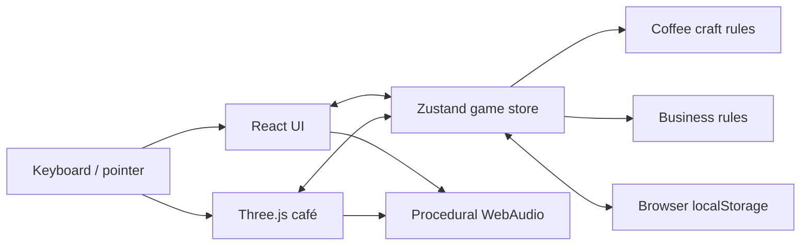

# Architecture

The browser owns the simulation and save. React renders the interface, React Three Fiber renders the café, and a shared Zustand store coordinates interactions. Pure coffee and business functions carry the rules that matter to testing.

| Location | Responsibility |
| --- | --- |
| `src/App.tsx` | Application and screen composition |
| `src/data/content.ts` | Recipes, guests, dialogue, and shop content |
| `src/store/game.ts` | Shift state, progression, customer service, and purchases |
| `src/store/barActions.ts` | Brewing actions and practice behavior |
| `src/store/persistence.ts` | Saved-state selection and compatibility defaults |
| `src/game/craft.ts` | Grind, extraction, recipe, and quality calculations |
| `src/game/business.ts` | Costs, quotes, goals, titles, and economics |
| `src/game/Scene.tsx` | Café scene and interaction coordination |
| `src/game/Environment.tsx` | Room, weather, furniture, and lighting |
| `src/game/Characters.tsx` | Player, guests, cat, and helper |
| `src/game/audio.ts` | Synthesized ambience and action sounds |
| `src/ui/Workstation.tsx` | Coffee-making interface |
| `src/ui/Management.tsx` | Café desk, stock, money, and customization |
| `src/ui/Phone.tsx` | Social feed, regulars, bank, and shop |
| `src/styles/` | Screen and component styles |
| `src/store/*.test.ts` | Regression tests for player actions and game rules |

## Extending a mechanic

For a new drink, start with the recipe content and craft rules, then update the brewing UI and unlock progression. Check that inventory is consumed once, the correct customer accepts it, and practice never produces a saleable cup after reload. The drink should teach one new idea before adding another control.

For a new upgrade, add the catalog item and its store behavior, then its scene or UI effect. Confirm affordability and repeated purchase behavior. When adding a saved field, provide a default for existing saves.

## Deployment

`npm run build` produces a static `dist/` directory. Vite uses relative asset paths so the build can be served from a static host. `.openai/hosting.json` identifies the existing Sites deployment; GitHub CI produces build artifacts and does not deploy or require hosting credentials.

There is no backend, cloud save, multiplayer service, or Steam integration. Audio begins after a user gesture. Saves are specific to the browser and origin; a local save does not automatically appear on the hosted version.
